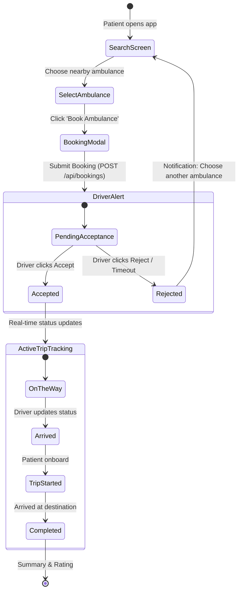

# AmbuNear --- MVP UI/UX Wireframe Sketches & Screen Layouts

This document defines the user interface (UI) and user experience (UX) layout sketches for the **AmbuNear MVP**. It covers the primary screens for both the **Patient / Attendant** and the **Ambulance Driver**, matching the core flows defined in [`PRD.md`](file:///d:/anti_gravity/AmbuNear/PRD.md) and [`ARCHITECTURE.md`](file:///d:/anti_gravity/AmbuNear/ARCHITECTURE.md).

> [!TIP]
> **Live Interactive Miro Board**: [Open AmbuNear MVP Sketch on Miro](https://miro.com/app/board/uXjVHjxRao4=)

---

## 1. Design Principles & Theme

- **Emergency First**: High contrast, minimal taps to book, clear visual hierarchy.
- **Color Palette**:
  - Emergency Primary: Red (`#E53935`)
  - Available Status: Emerald Green (`#10B981`)
  - Busy Status: Amber Orange (`#F59E0B`)
  - Offline Status: Slate Gray (`#64748B`)
  - Background & Cards: Clean White (`#FFFFFF`) and Light Gray (`#F8FAFC`)
- **Key Navigation**: Clear distinction between Patient flow and Driver Dashboard.

---

## 2. Screen 1: Patient Search & Nearby Ambulances

### Purpose
Allows users to enter or detect their current pickup location, visualize nearby available ambulances on a map, and review available options before booking.

### ASCII Wireframe Sketch

```text
┌──────────────────────────────────────────────────────────────────┐
│  [+] AmbuNear               [Emergency Call: 108]   (Profile) ☰  │
├──────────────────────────────────────────────────────────────────┤
│                                                                  │
│  🔍 [ Enter pickup location or use GPS current location     ⌖ ]  │
│                                                                  │
│ ┌────────────────────────────────────┐ ┌───────────────────────┐ │
│ │                                    │ │ Available Nearby (3)  │ │
│ │               [MAP]                │ ├───────────────────────┤ │
│ │                                    │ │ 🚑 DL-01-AB-1234      │ │
│ │       📍 You                       │ │ Type: Basic Life      │ │
│ │         \                          │ │ Distance: 1.2 km      │ │
│ │          \                         │ │ ETA: ~5 mins          │ │
│ │           🚑 Amb 1 (5m)            │ │ [ Book Ambulance ]    │ │
│ │                                    │ ├───────────────────────┤ │
│ │       🚑 Amb 2 (8m)                │ │ 🚑 UP-16-CD-5678      │ │
│ │                                    │ │ Type: Advanced (ICU)  │ │
│ │                                    │ │ Distance: 2.8 km      │ │
│ │                                    │ │ ETA: ~8 mins          │ │
│ │                                    │ │ [ Book Ambulance ]    │ │
│ │                                    │ ├───────────────────────┤ │
│ │                                    │ │ 🚑 DL-04-EF-9012      │ │
│ │                                    │ │ ETA: ~14 mins         │ │
│ │                                    │ │ [ Book Ambulance ]    │ │
│ └────────────────────────────────────┘ └───────────────────────┘ │
└──────────────────────────────────────────────────────────────────┘
```

### Components & Elements
1. **Top Bar**: AmbuNear branding, quick access emergency call fallback (108/112), user profile menu.
2. **Location Search Box**: Auto-completing address input with a "Detect My Location" (`⌖`) button.
3. **Map Canvas**: Displays patient pin (`📍`) and nearby active ambulances (`🚑`) with status halos.
4. **Ambulance List Panel**:
   - Vehicle registration number.
   - Ambulance category (Basic / ICU / Oxygen equipped).
   - Real-time calculated ETA and distance in kilometers.
   - Prominent call-to-action button: **`[ Book Ambulance ]`**.

---

## 3. Screen 2: Booking Confirmation Modal

### Purpose
Quick confirmation step before dispatching the request to the selected ambulance driver.

### ASCII Wireframe Sketch

```text
       ┌────────────────────────────────────────────────────────┐
       │                 Confirm Ambulance Booking              │
       ├────────────────────────────────────────────────────────┤
       │ Selected: 🚑 DL-01-AB-1234 (Basic Life Support)       │
       │ Estimated Arrival: ~5 mins (1.2 km away)               │
       ├────────────────────────────────────────────────────────┤
       │ Pickup Address:                                        │
       │ [ 113 MG Road, Sector 4, Metro Gate 2                ] │
       │                                                        │
       │ Destination / Hospital (Optional):                     │
       │ [ City Care Hospital, Main Road                      ] │
       │                                                        │
       │ Patient Name & Contact Phone:                          │
       │ [ Rahul Verma | +91 98765-43210                      ] │
       │                                                        │
       │ Emergency Note (Optional):                             │
       │ [ Difficulty breathing, wheelchair required          ] │
       ├────────────────────────────────────────────────────────┤
       │   [ Cancel ]              [ 🚨 Confirm & Send Request ]│
       └────────────────────────────────────────────────────────┘
```

---

## 4. Screen 3: Driver Dashboard & Availability Toggle

### Purpose
Enables the driver to toggle their operational availability (`AVAILABLE`, `BUSY`, `OFFLINE`) and receive incoming booking requests in real time.

### ASCII Wireframe Sketch

```text
┌──────────────────────────────────────────────────────────────────┐
│  [+] AmbuNear Driver           Status: [ ● AVAILABLE ▼ ]  (👤) ☰ │
├──────────────────────────────────────────────────────────────────┤
│                                                                  │
│  ┌────────────────────────────────────────────────────────────┐  │
│  │ 🚨 INCOMING EMERGENCY REQUEST! (Auto-rejects in 28s)        │  │
│  │                                                            │  │
│  │ Patient: Rahul Verma                                       │  │
│  │ Contact: +91 98765-XXXXX                                   │  │
│  │ Pickup:  113 MG Road, Sector 4 (1.2 km away, ~5 min ETA)   │  │
│  │ Drop:    City Care Hospital                                │  │
│  │ Note:    Difficulty breathing                              │  │
│  │                                                            │  │
│  │      [ ❌ REJECT ]                 [ ✔️ ACCEPT REQUEST ]     │  │
│  └────────────────────────────────────────────────────────────┘  │
│                                                                  │
│  ┌──────────────────────────────┐ ┌───────────────────────────┐  │
│  │ Today's Summary              │ │ Vehicle Status            │  │
│  │ Trips Completed: 4           │ │ Vehicle: DL-01-AB-1234    │  │
│  │ Hours Online:    5.2 hrs     │ │ Type:    Basic Life       │  │
│  │ Status:          On Standby  │ │ Rating:  ★ 4.8            │  │
│  └──────────────────────────────┘ └───────────────────────────┘  │
└──────────────────────────────────────────────────────────────────┘
```

### Components & Elements
1. **Availability Switcher**: 3-state selector (`AVAILABLE` in green, `BUSY` in orange, `OFFLINE` in gray).
2. **Incoming Request Alert Modal / Card**:
   - Urgent audio/visual cue with countdown timer (30-second expiry).
   - Pickup location with distance & ETA from driver's current coordinates.
   - Primary action buttons: Large Green **`[ ACCEPT REQUEST ]`** and Red **`[ REJECT ]`**.
3. **Driver Metrics**: Completed trips count and vehicle assignment status.

---

## 5. Screen 4: Active Trip & Status Tracking

### Purpose
Live tracking view shown to both the patient and driver while the trip is in progress, reflecting status changes through the trip lifecycle.

### ASCII Wireframe Sketch

```text
┌──────────────────────────────────────────────────────────────────┐
│  [+] AmbuNear Trip #BK-4920                  [ Emergency Help ]  │
├──────────────────────────────────────────────────────────────────┤
│                                                                  │
│  Trip Progress:                                                  │
│  (●)──────────(●)──────────(●)──────────(○)──────────(○)─────────│
│  Requested  Accepted    On The Way   Arrived  Trip Started  Done │
│                                                                  │
│ ┌────────────────────────────────────┐ ┌───────────────────────┐ │
│ │                                    │ │ Driver & Vehicle Info │ │
│ │               [MAP]                │ ├───────────────────────┤ │
│ │                                    │ │ Driver: Suresh Kumar  │ │
│ │             📍 Hospital            │ │ Phone:  +91 91234-5678│ │
│ │                 ^                  │ │ [ 📞 Call Driver ]    │ │
│ │                 |                  │ ├───────────────────────┤ │
│ │                 |                  │ │ Vehicle: DL-01-AB-1234│ │
│ │          🚑 Ambulance              │ │ Type:    Basic Life   │ │
│ │                 ^                  │ ├───────────────────────┤ │
│ │                 |                  │ │ Estimated Arrival:    │ │
│ │             📍 Pickup              │ │ ⏱️ 4 Minutes (0.9 km)│ │
│ │                                    │ ├───────────────────────┤ │
│ │                                    │ │ [ ❌ Cancel Booking ] │ │
│ └────────────────────────────────────┘ └───────────────────────┘ │
└──────────────────────────────────────────────────────────────────┘
```

### Trip Lifecycle Status Indicator
The progress bar transitions through the standard statuses defined in [`API_SPEC.md`](file:///d:/anti_gravity/AmbuNear/API_SPEC.md):
1. `REQUESTED` — Awaiting driver confirmation.
2. `ACCEPTED` — Driver accepted; preparing to leave.
3. `ON_THE_WAY` — Ambulance en route to pickup location.
4. `ARRIVED` — Ambulance reached patient pickup spot.
5. `TRIP_STARTED` — Patient onboard; en route to hospital destination.
6. `COMPLETED` — Trip safely delivered and marked complete.

---

## 6. Screen Flow & Navigation State Diagram



---

## 7. Responsive Breakpoint Adaptation

| Breakpoint | Layout Behavior |
| :--- | :--- |
| **Mobile (`< 768px`)** | Single column: Map on top half (45vh), scrollable ambulance cards or trip status sheet docked at bottom. Floating emergency action buttons. |
| **Tablet (`768px - 1024px`)** | Two-column split: Map (60% width), Ambulance discovery list or Driver control panel (40% width). |
| **Desktop (`> 1024px`)** | Full dashboard: Sticky side panel for filter/booking cards with rich interactive map viewport. |
